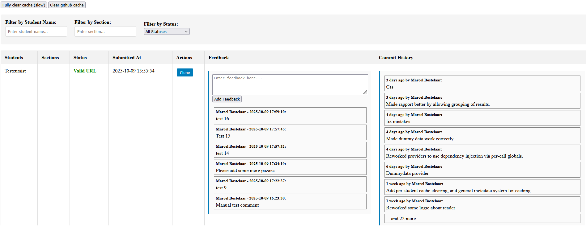
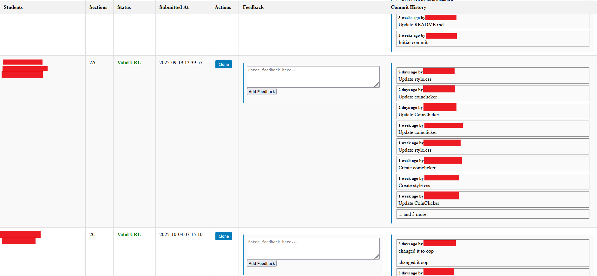

# GitHub Project Viewer for Teachers

A comprehensive web-based tool designed to streamline the management and review of student programming assignments that utilize GitHub repositories through Canvas LMS integration.

## Overview

This tool bridges the gap between Canvas LMS assignments and GitHub repositories, providing educators with a centralized interface to efficiently review, manage, and provide feedback on student coding projects. Instead of manually navigating between Canvas and GitHub for each student submission, teachers can access all the essential information and actions from a single, intuitive dashboard.

## Key Features

### 📋 **Canvas LMS Integration**
- Seamlessly connects with Canvas LMS assignments that contain GitHub repository links
- Automatically retrieves student submissions and associated GitHub URLs
- Maintains synchronization with Canvas gradebook and assignment data
- Supports course and assignment-specific views

### 🔍 **Repository Information at a Glance**
- **Commit History Visualization**: View recent commits with timestamps, authors, and descriptions
- **Repository Status Validation**: Quickly identify which submissions have valid GitHub links vs. invalid/missing URLs
- **Student Progress Tracking**: Monitor submission status and repository activity across all students
- **Group Overview**: Organize and view submissions by student groups or sections

### 💬 **Integrated Feedback System**
- **Teacher Comments**: Add comments and feedback directly to student submissions
- **Group Feedback**: Provide feedback that applies to entire student groups simultaneously
- **Feedback History**: Track all comments and feedback over time with timestamps
- **Persistent Storage**: All feedback is saved in Canvas and retrievable for future reference

### 📁 **Repository Management**
- **One-Click Cloning**: Clone student repositories directly to your local development environment

### 🎯 **Teacher-Focused Interface**
- **Centralized Dashboard**: View all student submissions in a single, organized interface
- **Efficient Workflow**: Reduce time spent switching between multiple platforms and tools

## How It Works

1. **Setup**: Add your Canvas LMS api key, the place to which you wish to clone the student projects and your github token (optional but recommended, free) to the .env file. Configure the server to use the src file as the root.
2. **Add assignments**: Configure the tool to connect with your Canvas course and GitHub-based assignment by editing the html links in the index page. The course and assignment ids are passed in the url.
3. **Automatic Discovery**: Open the dashboard. The system will take the assignment and load in all students, their sections and their groups. The initial setup may take time due to repeated api calls.
4. **Status Validation**: Each repository link is validated to ensure it's accessible and properly configured
5. **Centralized Review**: Sneak peak of the commit histories, earlier comments by colleagues, and group/student details in once overview.
6. **Feedback Integration**: Provide comments and feedback that sync back to your grading workflow
7. **Local Development**: Clone repositories for detailed code review in your preferred development environment

## Benefits for Educators

- **Time Savings**: Eliminate the need to manually visit dozens of individual GitHub repositories, or navigating the Canvas UI
- **Better Overview**: Gain immediate insight into course-wide and class-wide progress and submission quality
- **Streamlined Grading**: Combine repository analysis with feedback provision in a single workflow
- **Enhanced Collaboration**: Easily share feedback with student groups and track communication history for yourself and with colleagues
- **Professional Development**: Maintain organized records of student progress and your teaching feedback

## Technical Requirements

- PHP-enabled web server environment
- Canvas LMS API access
- GitHub API integration capabilities (key is optional and free via the token system, but leaving the token empty limits you to 50 github requests an hour)
- Local development environment for repository cloning functionality

This tool transforms the traditionally fragmented process of reviewing GitHub-based assignments into a cohesive, efficient workflow that allows educators to focus on what matters most: providing quality feedback and supporting student learning.

[Click here for info on the monkey patch](doc/monkeypatch.md)